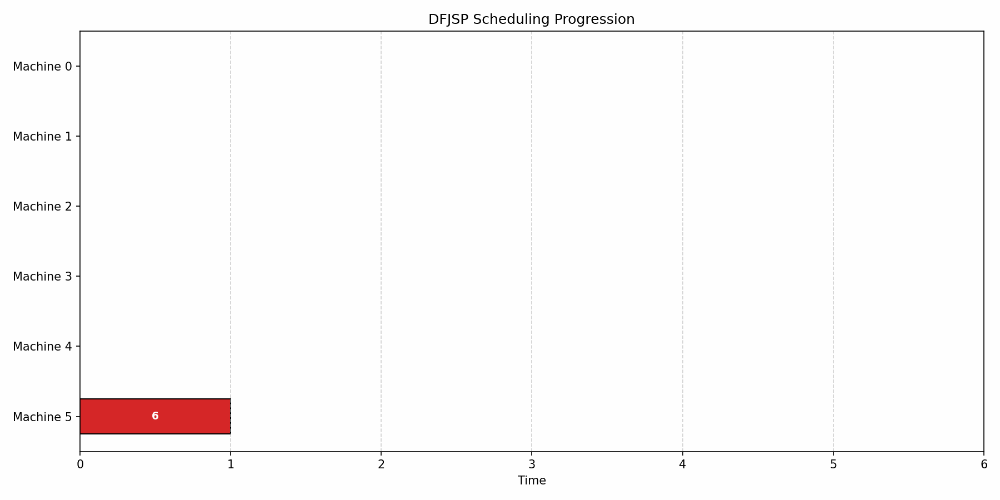

# LLM-Scheduling

create .env file with your OpenRouter API key
ex: OPENROUTER_API_KEY=sk-or-v1-12345678

## Run the simulation
specify parameters in config file
- model name (can be found on OpenRouter)
- session name
- problem file
- dynamic event file (optional)

1. python main.py (for LLM inference)
   python mainsimp.py (for greedy inference)
2. python simple_gantt.py

