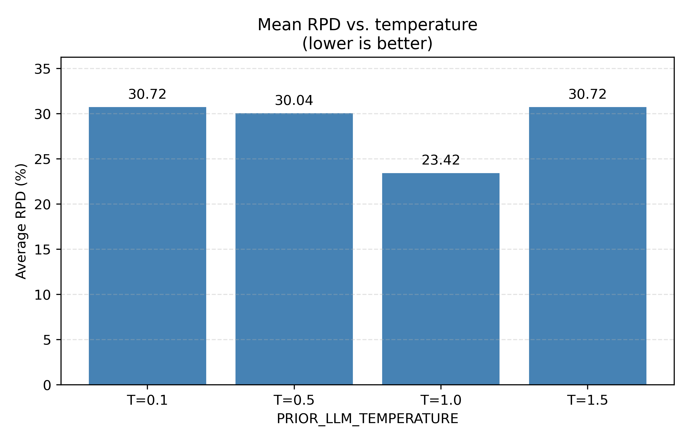

# Temperature sensitivity summary

**Source:** `results_*.json` under `results/sensitivity_analysis/temperature_test_2/` (batch `260504_011024`, sweep over `PRIOR_LLM_TEMPERATURE`).

**Fixed settings:** match `results/sensitivity_analysis/temperature_test_2/config.py` except `**PRIOR_LLM_TEMPERATURE`** per scenario.

**Problems:** `problem_data/small copy 4` (10 instances).

## 1. Final tardiness by instance and temperature

| Instance                  | T=0.1  | T=0.5  | T=1.0  | T=1.5  |
| ------------------------- | ------ | ------ | ------ | ------ |
| `small_k1.5_instance_000` | 3.784  | 3.784  | 3.784  | 3.784  |
| `small_k1.5_instance_001` | 26.202 | 24.442 | 26.202 | 26.202 |
| `small_k1.5_instance_002` | 3.963  | 0.514  | 2.758  | 3.963  |
| `small_k1.5_instance_003` | 0.333  | 0.598  | 0.333  | 0.333  |
| `small_k1.5_instance_004` | 9.696  | 9.696  | 9.696  | 9.696  |
| `small_k2.0_instance_000` | 4.196  | 4.196  | 7.019  | 4.196  |
| `small_k2.0_instance_001` | 1.097  | 2.360  | 1.372  | 0.859  |
| `small_k2.0_instance_002` | 0.000  | 0.000  | 0.000  | 0.000  |
| `small_k2.0_instance_003` | 4.140  | 2.739  | 1.418  | 4.140  |
| `small_k2.0_instance_004` | 1.045  | 2.252  | 1.045  | 1.045  |
| **Mean**                  | 5.446  | 5.058  | 5.363  | 5.422  |

## 2. Relative percentage deviation from best (RPD)

Per instance: **best** = minimum final tardiness among the four temperatures. **RPD (%)** = 100 ? (value ? best) / best. Best temperature(s) show **0.00**. If best = 0 and value > 0, cell shows **?** (undefined).

|              |           |           |           |           |
| ------------ | --------- | --------- | --------- | --------- |
| **Instance** | **T=0.1** | **T=0.5** | **T=1.0** | **T=1.5** |
| small_k1.5_instance_000 | 0.00   | 0.00   | 0.00   | 0.00   |
| small_k1.5_instance_001 | 7.20   | 0.00   | 7.20   | 7.20   |
| small_k1.5_instance_002 | 100.00 | 0.00   | 100.00 | 100.00 |
| small_k1.5_instance_003 | 0.00   | 79.58  | 0.00   | 0.00   |
| small_k1.5_instance_004 | 0.00   | 0.00   | 0.00   | 0.00   |
| small_k2.0_instance_000 | 0.00   | 0.00   | 67.28  | 0.00   |
| small_k2.0_instance_001 | 100.00 | 27.71  | 59.72  | 0.00   |
| small_k2.0_instance_002 | 0.00   | 0.00   | 0.00   | 0.00   |
| small_k2.0_instance_003 | 100.00 | 93.16  | 0.00   | 100.00 |
| small_k2.0_instance_004 | 0.00   | 100.00 | 0.00   | 100.00 |
| Average                 | 30.72  | 30.04	| 23.42	 | 30.72  |

## 3. Figure: average RPD by temperature

Bars plot the **Average** row from the table in section 2. Regenerate with `python plot_average_rpd_bars.py`.

